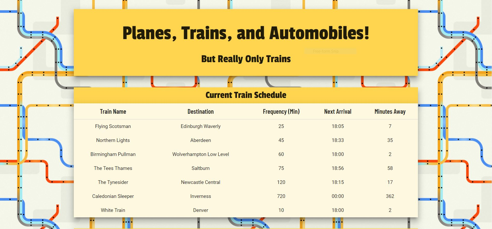
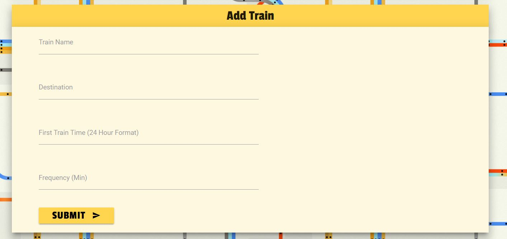

# Train Scheduler

* The train scheduler app saves train information in firebase, and calculates arrival times based on initial train times and current real time.

* A user scroll below the train schedule and can add their own train information, which will also be saved in firebase and the arrival times will also be calculated.

* Use Train Scheduler [here](https://eggobiggie.github.io/train-scheduler/)